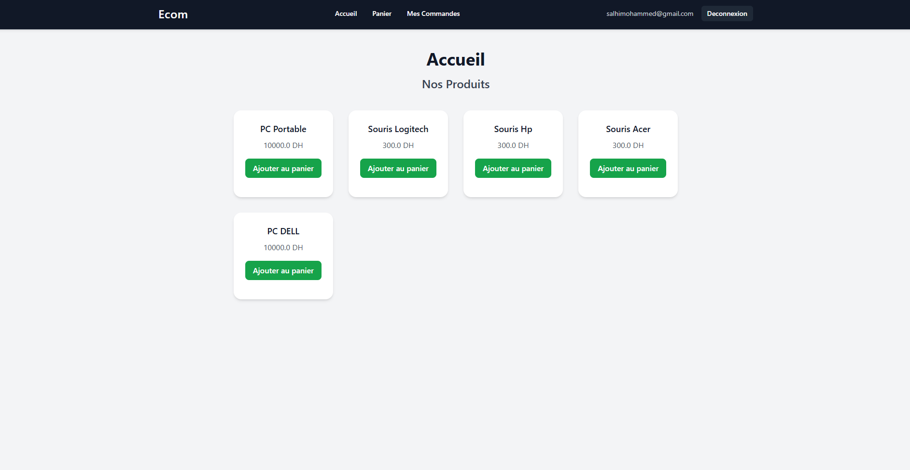
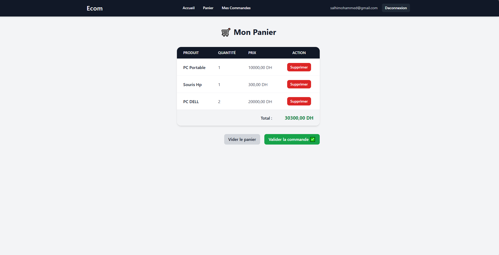

# Atelier 2 : Application Web MVC & JPA

Ce projet est une application web développée en Java dans le cadre d'un atelier, mettant en œuvre le pattern MVC (Modèle-Vue-Contrôleur) et l'API JPA (Jakarta Persistence API) avec Hibernate pour la persistance des données.

Il s'agit d'une application de gestion de produits et de commandes (type e-commerce simplifié).

## Technologies utilisées

L'application est construite avec les technologies suivantes :

* **Java (JDK 11)**
* **Jakarta EE 9.1** (pour les Servlets, JSP, CDI)
* **JPA (Jakarta Persistence API) 3.1**
* **Hibernate 6.2** (Implémentation JPA)
* **MySQL** (Base de données relationnelle)
* **Maven** (Gestion des dépendances et build)
* **Lombok** (Réduction du code boilerplate)
* **JSP (Jakarta Server Pages)** (Pour les vues)

## Structure du projet

Le projet suit une architecture MVC classique, organisée comme suit :

* **`ma.fstt.entities`** : Contient les entités JPA (Modèle) qui représentent les tables de la base de données (ex: `Produit`, `Client`, `Commande`, `Panier`).
* **`ma.fstt.services`** : Contient la logique métier (Services). Ils servent d'intermédiaire entre les contrôleurs et la couche d'accès aux données.
* **`ma.fstt.controller`** : Contient les Servlets (Contrôleurs). Elles gèrent les requêtes HTTP, interagissent avec les services et renvoient les vues (JSP).
* **`src/main/webapp`** : Contient les vues (fichiers `.jsp`) ainsi que les ressources statiques.
* **`src/main/resources/META-INF/persistence.xml`** : Fichier de configuration JPA/Hibernate pour la connexion à la base de données.

## Aperçus de l'application

Voici quelques aperçus de l'application et de sa conception.

### Schéma de la base de données

Diagramme de la base de données utilisée pour le projet.

### Gestion des Produits

Interface permettant de visualiser, ajouter, modifier ou supprimer les produits.

### Gestion du Panier

Interface de gestion du panier d'achat de l'utilisateur.

### Gestion des Commandes

Interface de suivi ou de gestion des commandes passées.

